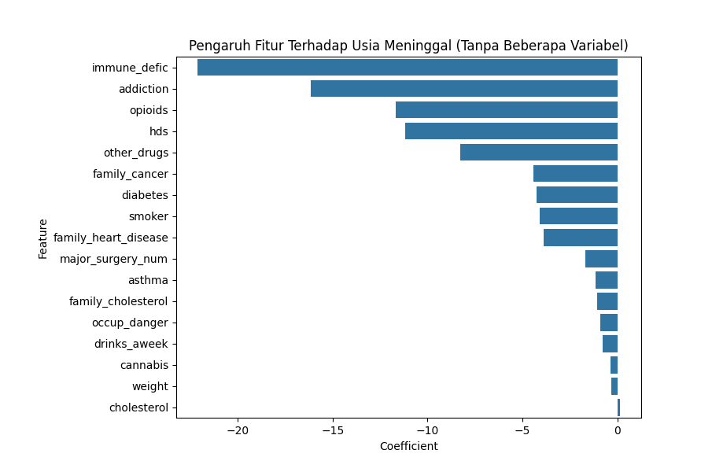

# Life Insurance Claim Analysis 🕊️  

This project explores patterns in life insurance claim data to understand:  
**What are the key factors that contribute to early death?**

By combining storytelling and data exploration, I analyzed how health conditions, lifestyle choices, and family history impact the age at which individuals pass away — which is at the core of life insurance claims.

---

## 🧪 Background

Life insurance claims are on the rise.  
But the question is: **Why?**

Is it poor lifestyle choices? Pre-existing health conditions? Or something inherited from family?

This project started with a simple curiosity:
> “What’s really behind the growing number of life insurance claims?”

---

## 🎯 Project Objectives

- Explore the age distribution of life insurance claimants
- Analyze the impact of lifestyle factors (smoking, alcohol, drug use) on age at death
- Examine whether family medical history contributes to early mortality
- Build a simple regression model to identify which features most significantly affect life expectancy

---

## 🗂️ Dataset Overview

The dataset used in this project was sourced from Kaggle:  
📎 [Individual Age of Death and Related Factors – Kaggle](https://www.kaggle.com/datasets/joannpineda/individual-age-of-death-and-related-factors/data)

Each row represents a **confirmed life insurance claim** (i.e., the individual has passed away).  
Columns include:
- Demographics: age, gender, weight, height, blood pressure
- Lifestyle: smoking, drinking, drug use, addiction
- Health: diabetes, heart disease, cholesterol levels, immune deficiency
- Family history: cancer, heart disease, cholesterol issues

The dataset was slightly modified and stored in the `/data/` folder as:

### 🔍 Visualization: Factors Influencing Age at Death

This regression plot visualizes the impact of various lifestyle and medical factors on the predicted age at death.

🔑 **Key insights:**
- **Addiction** and **immune deficiency** are among the most influential negative factors, strongly associated with a lower age at death.
- **Opioid usage** and a high number of alcoholic drinks per week also show a significant negative impact.
- Meanwhile, variables like **height**, **sex**, and **systolic blood pressure** (excluded in this plot) had minimal influence in this model, suggesting they are less predictive in this dataset.

This reinforces how lifestyle choices and pre-existing medical conditions play a much larger role in life expectancy compared to basic physical attributes.

